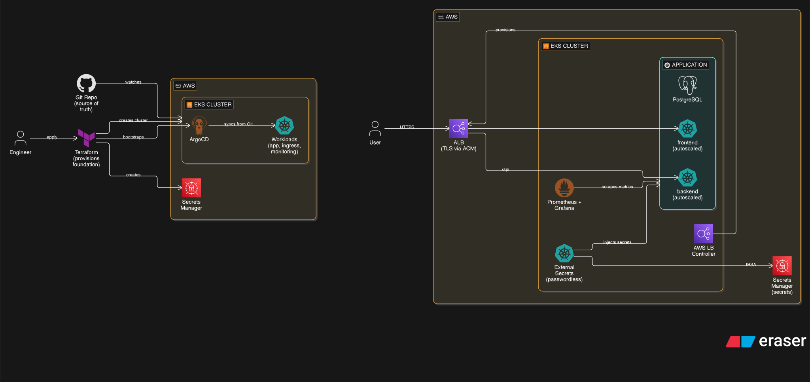

# Jerney — EKS

Production-style Amazon Elastic Kubernetes Service (EKS) deployment of the Jerney application.



---

## Stack

| Layer | Technology | Notes |
|---|---|---|
| Infra | **Terraform** | EKS cluster, VPC, Security Groups, IAM Roles for Service Accounts (IRSA), Secrets Manager |
| GitOps | **ArgoCD** | App-of-Apps pattern, auto-syncs with GitHub |
| Ingress | **AWS Load Balancer Controller** | Provisions an Application Load Balancer (ALB) |
| TLS | **AWS Certificate Manager (ACM)** | TLS terminated at the ALB |
| Secrets | **External Secrets Operator** | Syncs AWS Secrets Manager → K8s Secrets (via IRSA) |
| App | **Jerney** | React frontend + Node.js backend + PostgreSQL |
| Observability | **kube-prometheus-stack** | Prometheus + Alertmanager + Grafana |
| Logs | **Loki + Promtail** | Log aggregation, surfaced in Grafana |

---

## Repository Structure

```text
jerney-eks/
├── docs/
│   └── architecture.svg              # High-level architecture diagram
├── infra/
│   ├── bootstrap/                    # Step 1: S3 Bucket for Terraform remote state
│   ├── modules/                      # Reusable, single-responsibility resource modules
│   │   ├── networking/               # VPC + Subnets + Internet/NAT Gateways
│   │   ├── iam/                      # IAM Roles for EKS
│   │   ├── eks-cluster/              # EKS cluster + Managed Node Groups + OIDC
│   │   ├── irsa/                     # IAM Roles for Service Accounts (ALB Controller, ESO, EBS CSI)
│   │   ├── secrets-manager/          # AWS Secrets Manager secrets
│   │   └── eks-bootstrap/            # In-cluster bootstrap (ArgoCD, ALB Controller, ESO, gp3 StorageClass)
│   └── live/                         # Step 2: The Single Composition
│       ├── main.tf                   # Wires all modules together (ONE copy)
│       ├── variables.tf              # Every knob, no env-specific defaults
│       ├── outputs.tf                # All outputs
│       ├── versions.tf               # Providers + partial backend (no state key)
│       ├── providers.tf              # aws, helm, kubernetes provider configs
│       ├── tf.sh                     # Wrapper script (prevents env state mixups)
│       │
│       ├── dev.tfvars                # Dev knobs: SPOT, t3.medium, tracks 'main' branch
│       ├── staging.tfvars            # Staging knobs: SPOT, t3.medium, tracks 'staging' branch
│       └── prod.tfvars               # Prod knobs: ON_DEMAND, t3.large, tracks 'prod' branch
└── k8s-eks/
    ├── apps/                         # ArgoCD Application CRs (App-of-Apps)
    │   ├── platform-config.yaml      # wave 0 — namespaces + resource quotas
    │   ├── platform-secrets.yaml     # wave 0 — ExternalSecret CRs
    │   ├── prometheus-stack.yaml     # wave 1
    │   ├── jerney.yaml               # wave 1
    │   ├── loki-stack.yaml           # wave 2
    │   └── ingress-apps.yaml         # wave 2 — Ingress resources
    │   # Note: The root app, ALB Controller, and ESO are installed by
    │   #       Terraform (eks-bootstrap) using official HashiCorp providers.
    ├── helm/jerney/                  # Jerney application Helm chart
    │   ├── Chart.yaml
    │   ├── values.yaml
    │   └── templates/
    └── platform/
        ├── governance/               # ResourceQuotas + LimitRanges per namespace
        ├── ingress/                  # Ingress resource definitions
        ├── external-secrets/         # ExternalSecret CRs
        ├── prometheus-stack/         # Helm values
        └── loki-stack/               # Helm values
```

> The Terraform code uses a **"Single Composition"** pattern. `modules/` holds reusable resources. `live/main.tf` defines the cluster structure once. The exact environment (`dev`, `staging`, `prod`) is determined entirely by the `.tfvars` file and isolated in its own remote S3 state via the `tf.sh` wrapper script. A mistake in dev can never affect prod state.

---

## How It Works

**Secrets Flow:** AWS Secrets Manager → ESO (authenticates via IAM Roles for Service Accounts) → Kubernetes Secrets → Pods. No static AWS credentials exist inside the cluster.

**Traffic Flow:** Internet → Application Load Balancer (managed by AWS LB Controller) → NodePorts → Pods. TLS is terminated at the ALB using certificates from AWS Certificate Manager (ACM).

**Deployment Flow:** `git push` → ArgoCD detects diff on the environment's tracking branch → syncs in wave order (0 → 1 → 2).

---

## Setup

### Prerequisites

```bash
aws --version       # AWS CLI
terraform --version # >= 1.5
kubectl
helm
```

Ensure your AWS CLI is configured with the correct profile (e.g., `nilkanthaws9`).

---

### Step 1 — Bootstrap remote state

```bash
cd infra/bootstrap/
terraform init
terraform apply
```

Note the `state_bucket_name` output. State locking is handled natively by Terraform via S3 (`use_lockfile = true`), so no DynamoDB table is required. Ensure `infra/live/versions.tf` uses this bucket name in the `backend "s3"` block.

---

### Step 2 — Deploy an environment

Navigate to the unified composition directory:

```bash
cd infra/live/
```

We use a wrapper script (`tf.sh`) that dynamically initializes the correct S3 backend state key to prevent deploying `dev` code into `prod` state. Pass your environment (`dev`, `staging`, or `prod`) and your Terraform command:

```bash
# Pass secrets dynamically via environment variables so they aren't tracked in git
export TF_VAR_postgres_password="your-postgres-password"
export TF_VAR_grafana_admin_password="your-grafana-password"
export TF_VAR_alertmanager_smtp_key="your-smtp-key"

# Plan the infrastructure
./tf.sh dev plan

# Apply the infrastructure
./tf.sh dev apply
```

*(Alternatively, you can run the Terraform commands manually without the wrapper script by explicitly passing the backend config and variable file):*

```bash
# Initialize the state (must specify the key and -reconfigure)
terraform init -backend-config="key=jerney-eks/dev/terraform.tfstate" -reconfigure

# Plan
terraform plan -var-file="dev.tfvars"

# Apply
terraform apply -var-file="dev.tfvars"
```

This provisions the VPC, EKS cluster, Managed Node Groups, IAM Roles, Secrets Manager, and bootstraps ArgoCD via the Helm provider. It takes ~15 minutes.

---

### Step 3 — Connect kubectl

Update your local kubeconfig to interact with the new cluster (adjust region/name/profile as needed):

```bash
aws eks update-kubeconfig --region ap-south-1 --name jerney-eks-dev --profile nilkanthaws9
kubectl get nodes
```

---

### Step 4 — Point DNS

The AWS Load Balancer Controller will provision an Application Load Balancer based on the Ingress resources. Find the ALB DNS name:

```bash
kubectl get ingress -n jerney
# Note the ADDRESS column (e.g., k8s-jerneyplatform-xxx.elb.amazonaws.com)
```

In your DNS provider, create CNAME records pointing to the ALB DNS name:

```text
argocd.nilkanthprojects.site  →  CNAME  →  k8s-jerneyplatform-xxx.elb.amazonaws.com
grafana.nilkanthprojects.site →  CNAME  →  k8s-jerneyplatform-xxx.elb.amazonaws.com
jerney.nilkanthprojects.site  →  CNAME  →  k8s-jerneyplatform-xxx.elb.amazonaws.com
```

---

### Step 5 — Verify

```bash
# Verify ArgoCD is syncing all apps
kubectl get apps -n argocd

# Verify Secrets synced from AWS Secrets Manager
kubectl get externalsecrets -A

# Verify all pods are healthy
kubectl get pods -A
```

Access the ArgoCD UI by navigating to your configured domain (or via port-forwarding):
```bash
kubectl port-forward svc/argo-cd-argocd-server 8080:80 -n argocd
# Username: admin
# Password:
kubectl get secret argocd-initial-admin-secret -n argocd -o jsonpath='{.data.password}' | base64 -d
```

---

## Operations

### Update application image

Edit `k8s-eks/helm/jerney/values.yaml` on your target branch, change the `image.backend.tag` or `image.frontend.tag`, and push to GitHub. ArgoCD will detect the change and perform a rolling update automatically.

### Rotate a secret

Update the secret value in AWS Secrets Manager:
```bash
aws secretsmanager put-secret-value \
  --secret-id jerney-postgres-password \
  --secret-string "new-password" \
  --profile nilkanthaws9 \
  --region ap-south-1
```

Force ESO to refresh the Kubernetes secret immediately:
```bash
kubectl annotate externalsecret jerney-db-credentials \
  -n jerney force-sync=$(date +%s) --overwrite
```

### ⚠️ Destroy everything (Important)

> **WARNING:** The AWS Load Balancer Controller provisions ALBs and security groups (`k8s-traffic-*`, `k8s-<group>-*`) *outside* of Terraform. If you `terraform destroy` while they still exist, their ENIs/SGs block deletion of the Internet Gateway, subnets, and VPC — Terraform hangs for 10–15 min on `aws_internet_gateway` or `aws_vpc`.

**Step 1 — Remove the load balancers while the cluster is still healthy.**
Deleting just the Ingress objects does **not** work — ArgoCD `selfHeal` recreates them within seconds. You must delete the ArgoCD **Applications** so nothing recreates them:
```bash
aws eks update-kubeconfig --name jerney-eks-dev --region ap-south-1 --profile nilkanthaws9

# Finalizers cascade-delete the managed Ingresses; the LB controller then
# removes the ALBs + their security groups. This also stops selfHeal.
kubectl delete applications --all -n argocd

# CONFIRM the ALBs are gone before continuing (must print nothing):
aws elbv2 describe-load-balancers --region ap-south-1 \
  --query 'LoadBalancers[].LoadBalancerName' --output text --profile nilkanthaws9
```

**Step 2 — Destroy the environment.**
```bash
cd infra/live/
./tf.sh dev destroy
```

> **If destroy fails with `Unauthorized` / `Kubernetes cluster unreachable`:** Terraform tears down the cluster access entry before the in-cluster resources, so the `helm`/`kubernetes` providers lose auth mid-destroy. Drop those resources from state (they die with the cluster anyway) and re-run:
> ```bash
> terraform state rm \
>   module.eks_bootstrap.helm_release.argocd \
>   module.eks_bootstrap.helm_release.argocd_apps \
>   module.eks_bootstrap.helm_release.aws_lb_controller \
>   module.eks_bootstrap.helm_release.external_secrets \
>   module.eks_bootstrap.kubernetes_storage_class_v1.gp3
> ./tf.sh dev destroy
> ```

**Step 3 — Destroy the bootstrap infra** (only after all environments are gone):
```bash
cd ../bootstrap/
terraform destroy
```

**Step 4 — Orphan sweep.** EBS volumes (from PVCs) and any leaked ALB security groups outlive the cluster. Verify nothing is left billing:
```bash
export AWS_PROFILE=nilkanthaws9; R=ap-south-1
aws elbv2 describe-load-balancers --region $R --query 'LoadBalancers[].LoadBalancerName' --output text
aws ec2 describe-security-groups --region $R --filters Name=group-name,Values=k8s-* --query 'SecurityGroups[].GroupId' --output text
aws ec2 describe-volumes --region $R --filters Name=status,Values=available --query 'Volumes[].VolumeId' --output text
aws ec2 describe-nat-gateways --region $R --filter Name=state,Values=available --query 'NatGateways[].NatGatewayId' --output text
aws ec2 describe-vpcs --region $R --query 'Vpcs[?Tags[?Key==`Name` && contains(Value,`jerney`)]].VpcId' --output text
```
Delete anything these list — `aws ec2 delete-volume`, `delete-security-group`, etc. (Unattached EBS volumes bill ~$0.10/GB/mo; NAT gateways bill hourly.)
